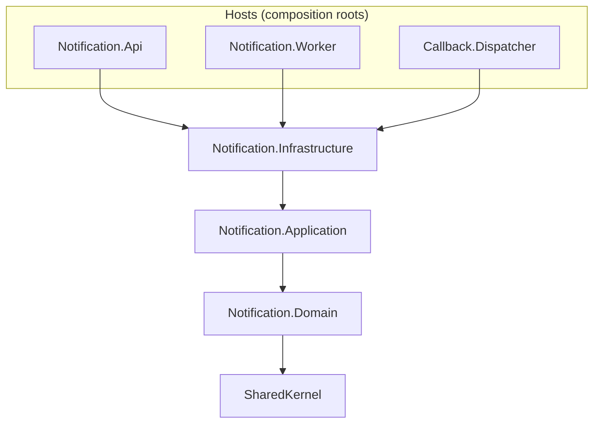
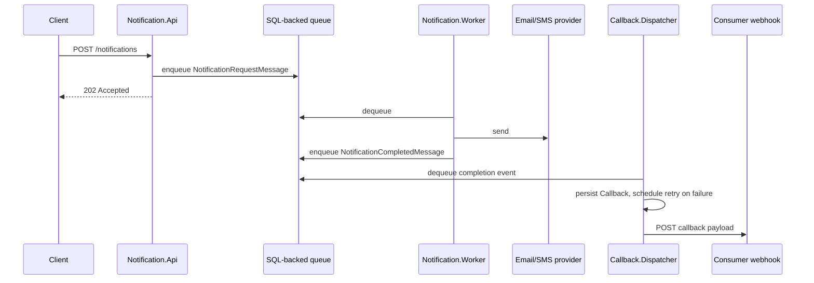

# Notification Service

[](https://github.com/dkhot/Notification-Service/actions/workflows/ci.yml)
[](LICENSE)
[](https://dotnet.microsoft.com/)

Proof-of-concept Enterprise Notification Service built on .NET 10 with DDD / Clean Architecture,
background workers, a SQL-backed queue, provider adapters, callback dispatching, retry behavior,
Docker Compose, and unit tests.

## What This Demonstrates

- **Clean Architecture refactor**: the solution started as a non-compiling, layer-collapsed prototype
  (duplicate enums/DTOs across projects, a repository interface whose implementation used mismatched
  types) and was rebuilt into an enforced DDD/Clean Architecture.
- **Spec-driven**: scope and structure trace back to source `.docx` requirement/implementation documents,
  not ad hoc decisions — see [Spec-driven development](#spec-driven-development) below.
- **Rich domain model**: `Callback.ScheduleRetry(...)` owns the exponential-backoff/max-attempts policy;
  `Notification` exposes behavior methods (`MarkSent`, `MarkFailed`, ...) instead of public setters.
- **Application layer testable without a database**: use-case handlers depend only on repository/queue
  ports, so unit tests use plain in-memory fakes — no EF Core `InMemory` provider required.
- **Production-shaped workflow**: HTTP intake, asynchronous processing, provider dispatch, callback
  persistence, retry scheduling, health checks, Docker Compose, and CI.

## Spec-driven development

This service is built spec-first: the requirements and project layout are not inferred from code, they
come from two source documents that remain the authority for scope and structure —

- [`docs/Specification.docx`](docs/Specification.docx) — problem statement, functional/non-functional
  requirements, high-level architecture, event contract, storage schema, sequence and failure-handling
  flows, and the open decisions/questions for the POC.
- [`docs/ImplementationPlan.docx`](docs/ImplementationPlan.docx) — the feature breakdown (solution
  structure, `POST /notifications`, the notification worker, providers, the callback dispatcher, testing)
  and the deliverables per feature, including the project/folder structure the Architecture section below
  implements.

Changing scope (new channels, new endpoints, retry/backoff policy, storage shape) starts by updating
these documents, not by adding ad hoc code. The architecture rules in
[`docs/ArchitectureRules.md`](docs/ArchitectureRules.md) keep the implementation honest against them.
When the two disagree with the running code, the docs win and the code is the thing to fix.

## Architecture

Dependencies flow one way only — hosts depend on Infrastructure, Infrastructure implements the ports
Application defines, Application depends on Domain, Domain depends only on SharedKernel:



End-to-end request flow:



See [`docs/ArchitectureRules.md`](docs/ArchitectureRules.md) for the project boundary rules.

## Projects

- `Notification.Api` - Minimal HTTP API host. `POST /notifications` maps straight to the
  `ICreateNotificationHandler` Application use case.
- `Notification.Worker` - Background host that dequeues notification requests and delegates each one to
  the `IProcessNotificationHandler` Application use case (resolves a provider, sends, updates status,
  publishes the completion event).
- `Callback.Dispatcher` - Background host that delegates to the `IHandleNotificationCompletedHandler` and
  `IDispatchPendingCallbackHandler` Application use cases (persist callback, retry with backoff, invoke
  the consumer's webhook).
- `Notification.Application` - Use-case handlers (`Notifications/`, `Callbacks/`), validators, and the
  ports Infrastructure implements (`Abstractions/`: `IMessageQueue`, `INotificationProvider(Resolver)`,
  `IWebhookSender`). No EF Core, no HTTP client, no queue SDK.
- `Notification.Domain` - Rich entities (`Notification`, `Callback`, `SourceConfiguration`) with factory
  methods and behavior (e.g. `Callback.ScheduleRetry` owns the retry/backoff policy), repository ports
  (`Repositories/`), and typed domain exceptions (`Exceptions/`).
- `Notification.Infrastructure` - Implements every Domain repository port and every Application
  abstraction port: EF Core persistence (`Persistence/`), file-based Email/SMS providers (`Providers/`),
  the HTTP webhook sender (`Webhooks/`), health checks, and the `AddNotificationInfrastructure` DI
  extension.
- `SharedKernel` - Cross-process contracts only: enums (`NotificationChannel`, `NotificationStatus`,
  `CallbackStatus`) and queue wire-format messages (`Messages/`).
- `Notification.Tests` - xUnit tests for Application handlers (using in-memory fakes of the Domain ports —
  no database needed) and Domain entity behavior (e.g. the `Callback` retry policy).

## Local Configuration

This repo does not commit real secrets. Docker Compose reads local values from `.env`, which you can create from the provided example:

```bash
cp .env.example .env
```

For local non-Docker runs, set the connection string through environment variables:

```bash
ConnectionStrings__NotificationDatabase="Server=localhost,1433;Database=NotificationService;User Id=sa;Password=<your-local-password>;TrustServerCertificate=True;"
```

On PowerShell:

```powershell
$env:ConnectionStrings__NotificationDatabase="Server=localhost,1433;Database=NotificationService;User Id=sa;Password=<your-local-password>;TrustServerCertificate=True;"
```

## Running Locally

1. Create `.env` from `.env.example` and set `SA_PASSWORD`.
2. Start SQL Server:

```bash
docker compose up -d sqlserver
```

3. Run the API:

```bash
dotnet run --project src/Notification.Api/Notification.Api.csproj
```

4. Run the workers in separate terminals:

```bash
dotnet run --project src/Notification.Worker/Notification.Worker.csproj
dotnet run --project src/Callback.Dispatcher/Callback.Dispatcher.csproj
```

## API Example

Submit a notification:

```bash
curl -X POST http://localhost:5000/notifications \
  -H "Content-Type: application/json" \
  -d '{
    "messageId": "demo-001",
    "sourceId": "inventory",
    "eventType": "StockLow",
    "channel": "email",
    "recipient": "ops@example.com",
    "subject": "Low stock alert",
    "body": "SKU ABC-123 has dropped below threshold."
  }'
```

Expected response:

```json
{
  "id": "00000000-0000-0000-0000-000000000000"
}
```

The API returns `202 Accepted` after enqueueing the notification. The worker later processes it and the dispatcher posts a completion callback when callback configuration is available.

## Docker

To build and run the full stack with Docker Compose:

```bash
docker compose up --build
```

## Tests

Run unit tests with:

```bash
dotnet test src/Notification.Tests/Notification.Tests.csproj
```

CI runs the same two commands on every push/PR via `.github/workflows/ci.yml`.

## License

MIT — see [`LICENSE`](LICENSE).
